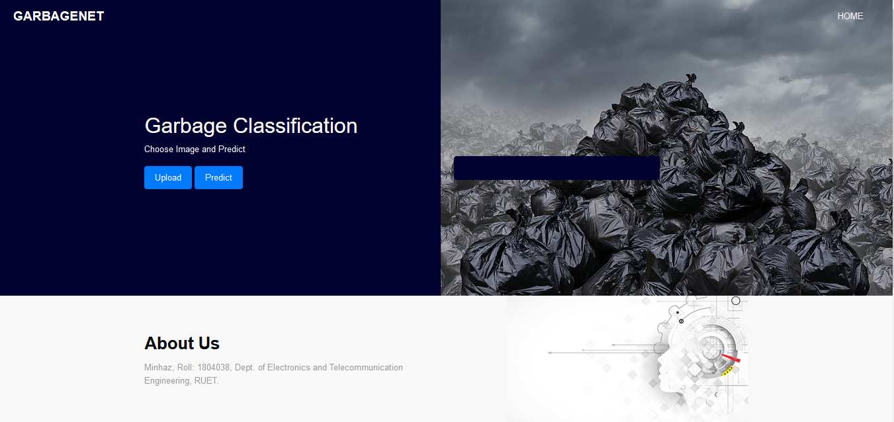
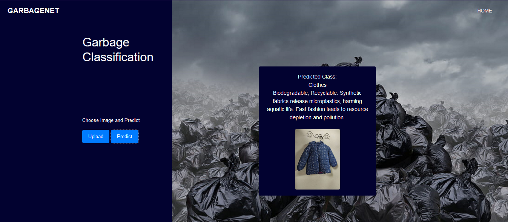
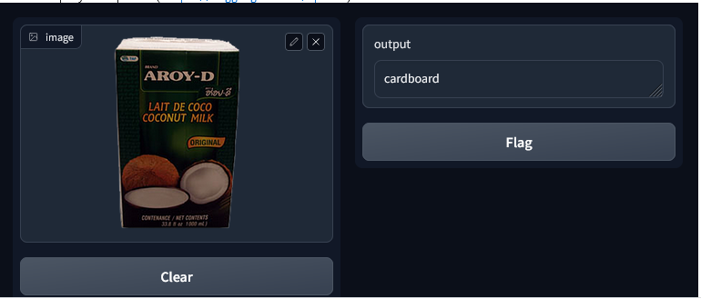

# Waste Classification Model Deployment ♻️🚮

This repository contains the files for a deep learning-based **Waste Classification** project. The project focuses on automating the classification of various waste types using advanced deep learning techniques. The model (`Mmodel.h5`) used for the deployment and prediction via the website is included in this repository. A **trial model** for exploration purposes can be found [here](https://github.com/Miinhaz/Garbage_classification_deployment/blob/main/templates/final-model.ipynb).

## Project Overview
The aim of this project is to classify waste materials such as **Metal**, **Plastic**, **Glass**, **Paper**, and more using a modified deep learning architecture. This automation helps streamline waste management processes, contributing to more sustainable practices and efficient waste sorting systems.

The architecture incorporates a **Modified DenseNet201** model with a **Parallel CNN Approach** utilizing **Squeeze-and-Excitation (SE) blocks**, providing significant improvements over existing methods in terms of both accuracy and efficiency.

## Key Features
- **Flask App**: A web interface for deploying the waste classification model.
- **TensorFlow-based Model** (`Mmodel.h5`): Used for real-time predictions via the web interface.
- **Gradio Interface**: A simpler method of deployment for fast and easy testing.
- **Modified DenseNet201 Architecture**: Enhanced using a parallel CNN approach with **Squeeze-and-Excitation (SE) blocks** for improved accuracy.
- **Image Preprocessing**: Automatically resizes and normalizes images for accurate predictions.

## 🧠 Model Architecture
The core model is based on **Modified DenseNet201** combined with a **Parallel CNN Approach**. This model employs **Squeeze-and-Excitation (SE) blocks** that dynamically recalibrate channel-wise feature responses, enabling the network to focus on more important features.

### Key Advantages:
- **Improved accuracy** by refining the model’s ability to focus on critical features of the waste images.
- **Efficient learning** through the use of SE blocks, which allow better feature extraction with less computational cost.
- **Better performance** than existing architectures due to the combination of DenseNet’s deep feature propagation and SE's feature recalibration mechanism.

This approach has proven to deliver **better results** in waste classification compared to conventional models by effectively handling the complexity of classifying a diverse range of waste types.

### How it Works:
- The **Parallel CNN branches** with both **MaxPooling** and **AveragePooling** are used to extract complementary features from the input image.
- The **Squeeze-and-Excitation mechanism** enhances the network's focus on the most important parts of the input image, leading to improved classification accuracy.


### Static & Templates
- The **HTML, CSS, and JavaScript** files for the web interface are located in the `static` and `templates` folders.
- The web interface allows users to upload images of waste for classification.

## Flask Application (`app.py`)
The Flask app deploys the model and handles image uploads and predictions via a simple web interface.

```python
from flask import Flask, render_template, request, jsonify
import tensorflow as tf
import cv2
import numpy as np

app = Flask(__name__)

# Load the trained model
model = tf.keras.models.load_model("Mmodel.h5")

# Define class labels and mapping
numeric_class_labels = ["0", "1", "2", "3", "4", "5", "6", "7", "8", "9"]

def get_class_name(label):
    class_names = [
        "Metal", "Glass", "Biological", "Paper", "Battery", 
        "Trash", "Cardboard", "Shoes", "Clothes", "Plastic",
    ]
    return class_names[int(label)]

# Preprocess the image
def preprocess_image(image_path):
    img = cv2.imread(image_path)
    img = cv2.resize(img, (110, 110))
    img = img / 255.0  # Normalize
    return img

@app.route("/predict", methods=["POST"])
def predict():
    if "image" not in request.files:
        return jsonify({"error": "No image uploaded"})

    image = request.files["image"]
    image.save("temp.jpg")
    processed_image = preprocess_image("temp.jpg")
    prediction = model.predict(np.expand_dims(processed_image, axis=0))
    class_index = np.argmax(prediction)
    predicted_class_numeric = numeric_class_labels[class_index]
    predicted_class_name = get_class_name(predicted_class_numeric)

    # Additional information about the waste type
    class_info = {
        "0": "Non-biodegradable, Recyclable. Metal waste contributes to soil and water pollution.",
        "1": "Non-biodegradable, Recyclable. Broken glass persists in the environment for centuries.",
        "2": "Biodegradable, Recyclable. Organic waste produces methane in landfills.",
        # Additional class descriptions...
    }

    predicted_text = class_info[predicted_class_numeric]

    return jsonify({"prediction": predicted_class_name, "text": predicted_text})

if __name__ == "__main__":
    app.run(debug=True)
```

## Gradio Interface Deployment

The project also provides a **Gradio interface** for quick testing and deployment.

```python
import gradio as gr
import numpy as np
import cv2
import os

# List of class names
class_names = os.listdir(train_path)

# Define the function for making predictions
def predict_label(image):
    # Convert PIL image to numpy array
    image_np = np.array(image)

    # Convert RGB to BGR format
    image_bgr = cv2.cvtColor(image_np[:, :, ::-1], cv2.COLOR_RGB2BGR)

    # Preprocess the image
    target_shape = (110, 110)
    resized_image = cv2.resize(image_bgr, target_shape)
    input_image = np.expand_dims(resized_image, axis=0)
    input_image = input_image.astype('float32') / 255.0

    predicted_probabilities = model_dn169.predict(input_image)[0]
    predicted_class_index = np.argmax(predicted_probabilities)
    predicted_label = class_names[predicted_class_index]

    return predicted_label

# Create a Gradio interface
gr_interface = gr.Interface(
    fn=predict_label,
    inputs=gr.inputs.Image(),
    outputs=gr.outputs.Textbox(),
    live=True,
    capture_session=True
)

# Launch the Gradio interface
gr_interface.launch()
```

### Model Details
- The **Mmodel.h5** file contains the deep learning model based on **Modified DenseNet201** architecture with **Parallel CNN branches** and **Squeeze-and-Excitation (SE) blocks**. This architecture provides enhanced accuracy by allowing the model to focus on the most relevant features of waste images.

## Deployment Methods

### Flask-based Deployment
Users can interact with the model via a web interface to upload images and receive predictions.

- **Image 1**: Flask Web Interface  
  

- **Image 2**: Uploading and Predicting via Flask  
  

### Gradio Deployment
For a simpler deployment, the project also provides a **Gradio interface**, which allows users to test the model quickly and easily.

- **Image 4**: Gradio Deployment Image  
  

## 🛠 Technologies Used
- **Flask** for the web framework
- **TensorFlow/Keras** for model deployment
- **OpenCV** for image preprocessing
- **HTML/CSS/JS** for the front-end interface
- **Gradio** for a simplified deployment interface

## 🔄 Future Work
- **AI Enhancements**: Incorporating AI for automatic waste sorting without human intervention.
- **Larger Dataset**: Expanding the dataset for more generalized and accurate predictions.
- **Cloud Deployment**: Deploying the model on cloud platforms like AWS or GCP for broader accessibility.

## 📝 Supreme Version

A supreme version of this entire work is presented in a journal paper, which is currently under review in PLoS ONE.


